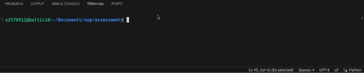
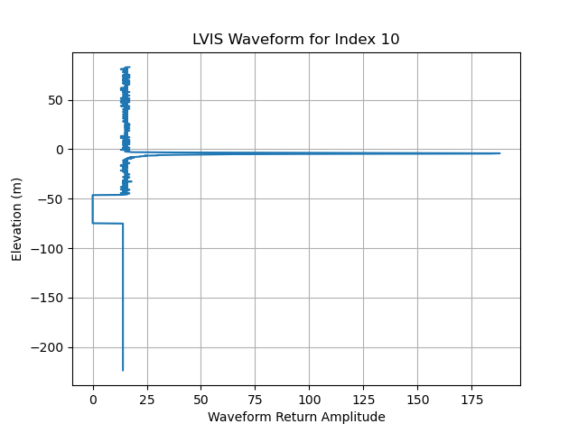
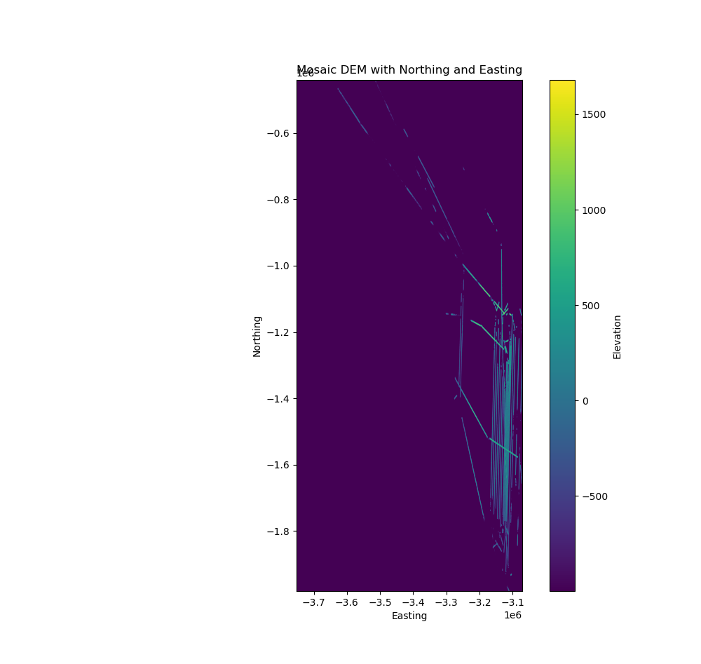
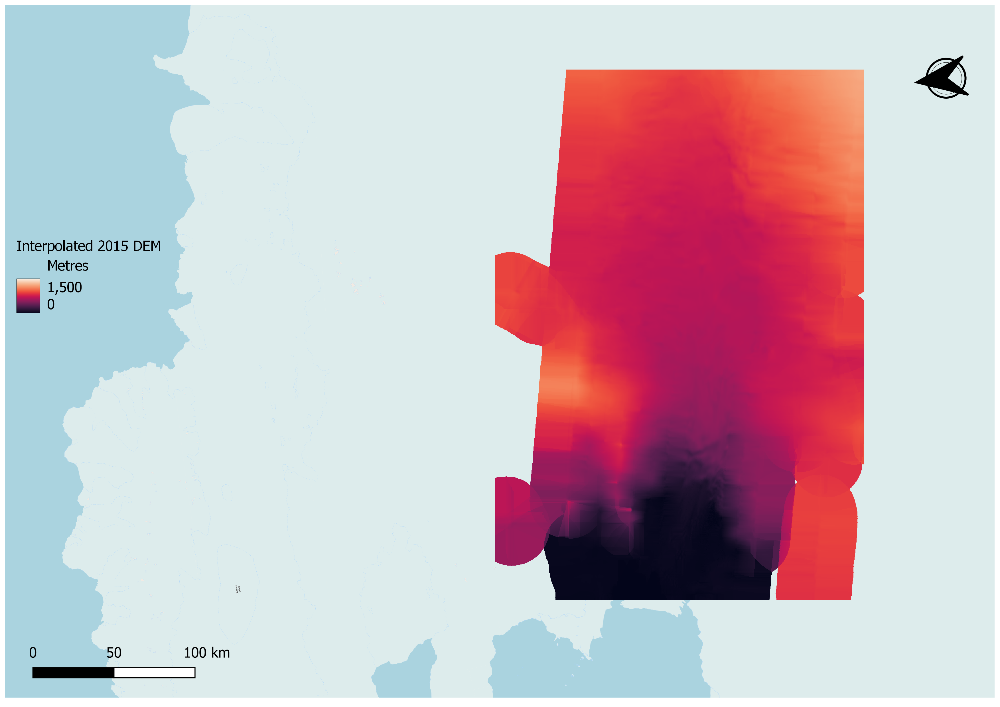
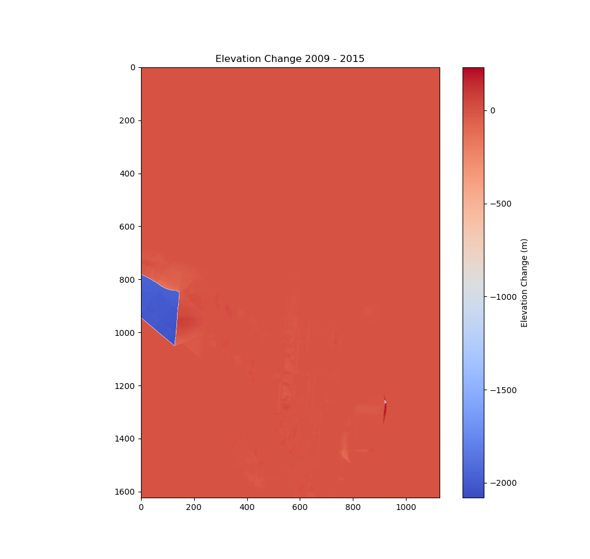

## Assessment | Measuring Ice Volume Change in Pine Island Glacier using LVIS data

# Table of contents
1. [Introduction](#introduction)
2. [Task 1 - LVIS Waveform Plotter](#paragraph1)
3. [Task 2 - DEM Generation and Processing with 'plotLVIS'](#paragraph2)
4. [Task 3 - Mosaic Generation for 2009 and 2015 data](#paragraph3)
5. [Task 4 - DEM Gap Filling](#paragraph4)
6. [Task 5 - Calculating the Difference in Ice Volume between 2009 and 2015](#paragraph5)

## Introduction <a name="introduction"></a>

This repository contains a series of Python scripts, each is designed to tackle specific tasks - ranging from waveform plotting and DEM generation to mosaicking anf gap filling. The main purpose of this repository is to work towards conducting a comparative analysis of ice volume changes between 2009 and 2015. 

## Task 1 - LVIS Waveform Plotter <a name="paragraph1"></a>

file - 'src/task1.py'

Packages used:
- argparse
- matplotlib
- numpy
- os
- lvisClass

This task focused on plotting a waveform from the LVIS 2009 dataset. The **'plotLVIS'** class was created by inheriting from **'lvisData'**, is designed to extract and visualize waveform data from LVIS files. It provides a method **'plotWave'** which takes a specified waveform index and generates a corresponding plot of waveform return amplitude against elevation. This is used in conjunction with the **'parse_arguments'** function, which contains a series of command line arguments that allow the user to specify several parameters:
```
- '--input_file' - Which will use a default LVIS file if one is not specified.
- '--output_file' - Which will send the plot to a default folder unless the user specifies an alternative.
- '--waveform_index' - Which will use a default waveform unless the user specifies a specific waveform.
```

An example application is shown below:



This command takes the input file **'/geos/netdata/oosa/assignment/lvis/2009/ILVIS1B_AQ2009_1020_R1408_049700.h5'**, set an output directory at **'src/outputs/t1_outputs'/** with the name **'waveform_example.png'**, and then chooses to plot the 10th waveform from the image. 

The output derived from this is as follows:



## Task 2 - DEM Generation and Processing with 'plotLVIS' <a name="paragraph1"></a>

file - 'src/task2.py'

Modules used:
- argparse
- processLVIS
- lvisCompleteExample
- pyproj
- numpy 

The script for Task 2, leveraging the **'plotLVIS'** class, is designed for advanced processing and visualization of LVIS data, generating Digital Elevation Models (DEMs). It employs the **'lvisGround'** class for ground estimation and utilizes **'writeTiff'** for outputting geotiff files, crucial for spatial analysis and mapping applications.

Key Features:
- **Command Line Flexibility**: Enables specifying input files, output directories, projection details - that link with **'reprojectLVIS'**, and DEM resolution, enhancing usability and automation potential.
- **Geospatial Transformation**: Incorporates **'pyproj'** for accurate projection handling, ensuring reliable geospatial referencing.
**Iterative Processing**: Efficiently processes spatial subsets, catering to large datasets by minimizing memory usage and optimizing computation.

An example of usage is shown below:

```
python src/task2.py --input '/path/to/input.h5' --outRoot 'DEM' --projection 3031 --resolution 30 --output-dir '/path/to/output'
```

This command processes LVIS data, reprojects it, estimates ground elevation, and outputs a geotiff, demonstrating the script's capability to generate detailed and accurate DEMs from LVIS LIDAR data. The bounding region is left as the default but there is the option to change it if required.

An example output from using this script is shown below:


A detailed explanation of each command line argument is outlined below:

```
- '--input' (inName): Specifies the path to the input LVIS file from which the DEM will be generated.
- '--outRoot' (outRoot): Defines the root name for the output files, allowing for structured and recognizable file naming.
- '--projection' (projection): Determines the EPSG code for the desired output projection, essential for accurate geospatial analysis and integration with other geospatial datasets.
- '--resolution' (resolution): Sets the resolution for the output DEM, balancing detail and file size to suit analysis needs.
- '--output-dir' (output_dir): Specifies the directory where the output DEM files will be saved, organizing output for easy access and management.
- '--min-x' (min_x), '--min-y' (min_y), '--max-x' (max_x), '--max-y' (max_y): Define the spatial extent for the DEM processing, allowing targeted analysis within a specified bounding box.
- '--step-size' (step_size): Adjusts the granularity of the spatial processing, optimizing computational efficiency and data handling.
```

## Task 3 - Mosaic Generation for 2009 and 2015 data<a name="paragraph3"></a>

file - src/task3.py

Modules Used:

- os
- argparse
- glob
- lvisClass
- osgeo.gdal
- numpy

The script automates the conversion of LVIS HDF5 data files into individual Digital Elevation Model (DEM) GeoTIFFs and then mosaics them into a single, comprehensive GeoTIFF file. It facilitates large-scale geospatial analyses by handling multiple datasets efficiently.

Key Functions:

- **getCmdArgs()**: Establishes a CLI for script interaction, allowing specification of directories, mosaic naming, and DEM attributes.
- **process_files_to_dem()**: Manages HDF5 data, converting each file into DEM tiles with defined resolution and tiling strategy, storing the outcomes in a designated folder.
- **create_mosaic()**: Aggregates DEM tiles into a single mosaic, leveraging GDAL's capabilities for spatial data synthesis.

Overview of command line arguments:
```
--input_folder: Path to the directory containing LVIS HDF5 files.
--output_folder: Destination directory for the DEM GeoTIFFs and the final mosaic.
--mosaic_name: Base name for the output mosaic files.
--step_divisor: Divides the range of coordinates to determine the step size for processing tiles.
--resolution: The spatial resolution of the output DEM.
```

Example usage:

```
python task3.py --input_folder 'path/to/lvis/data' --output_folder 'path/to/output' --mosaic_name 'mosaic_output' --step_divisor 10 --resolution 100
```

By default, the script is configured to process 2015 LVIS data at a resolution of 200, with a step divisor of 15, which influences the tile size for DEM generation. It emphasizes the ability to reproject data into the EPSG:3031 projection, suitable for Antarctic datasets.
Example output:





## Task 4 - DEM Gap Filling <a name="paragraph4"></a>

File - src/task4.py

Modules used:

- argparse
- numpy
- rasterio
- geopandas

This script is designed to refine DEMs by filling 'no-data' gaps and clipping it to a specified boundary. It ensures that the DEMs are subsetted to enhance computational performance and improve accuracy by removing flightlines over the water.

Key Functions:

- **get_cmd_args()**: Takes user-defined parameters for processing, including input/output file paths, and gap-filling parameters.
- **clip_and_fill()**: Fills no-data values within the DEM using rasterio's fill functionality and then clips the DEM to the provided boundary shapefile.

Command line arguments are used to allow customization of input and output file paths, as well as other parameters like the maximum search distance for gap-filling. By default, the script is configured to process a predefined DEM file and output the filled DEM with a resolution that minimizes gaps.

Overview of command line arguments:

```
- --input: Path to the input GeoTIFF file.
- --output: Path for the filled and clipped output GeoTIFF file.
- --nodata_value: Specifies the no-data value in the input file.
- --max_search_distance: Defines the extent for searching nearby valid values for interpolation.
- --smoothing_iterations: Number of iterations for smoothing after filling.
- --boundary_shapefile: Path to the shapefile for DEM clipping.
```

Example usage:

```
python task4.py --input 'path/to/input.tif' --output 'path/to/output.tif' --nodata_value -999 --max_search_distance 50 --smoothing_iterations 0 --boundary_shapefile 'path/to/boundary.shp'
```

Example output:




## Task 5 - Calculating Ice Volume Change between 2009 and 2015 <a name="paragraph5"></a>

file - src/task5.py

Modules Used:

- rasterio
- numpy
- matplotlib

This script conducts a comparative analysis of DEMs from two 2009 and 2015 to quantify and visualize the changes in glacier elevation. It processes the input DEMs to compute the volume change and generates a map highlighting these changes.

Key Functions:

- **read_geotiff()**: Reads in the elevation data from the GeoTIFF files.
- **calculate_volume_change()**: Calculates the net change in volume between the two DEMs by computing the difference in elevation values.
- **create_change_map()**: Generates a GeoTIFF showing the elevation change between the two years.

Example output:



